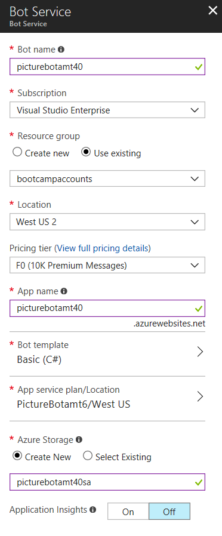
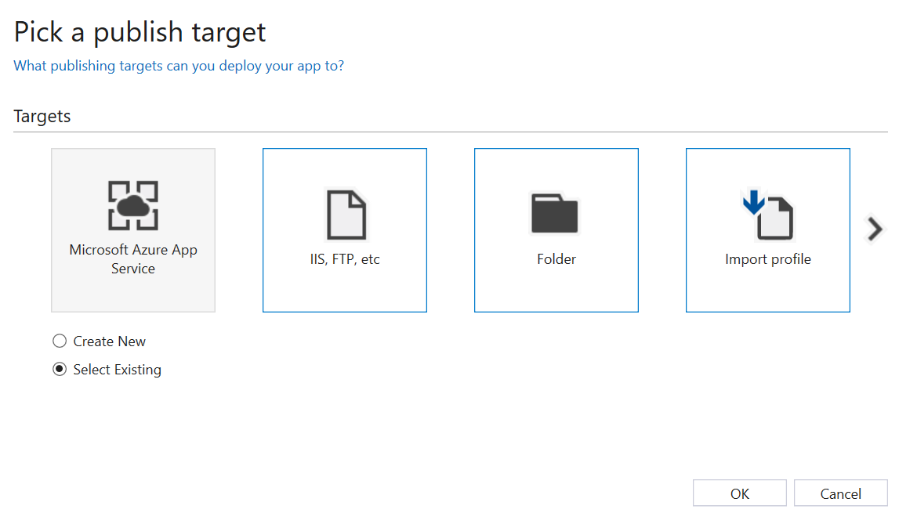
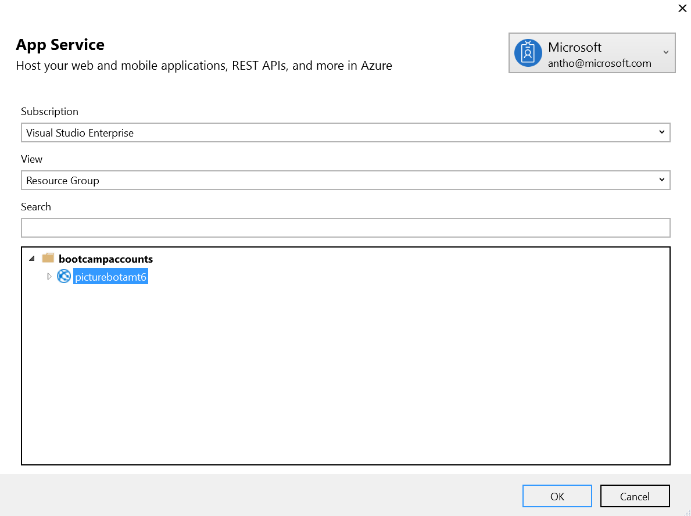

## 4_Publish_and_Register:
Estimated Time: 10-15 minutes

### Lab 4.1: Publish your bot

A bot created using the Microsoft Bot can be hosted at any publicly-accessible URL.  For the purposes of this lab, we will register our bot using [Azure Bot Service](https://docs.microsoft.com/en-us/bot-framework/bot-service-overview-introduction).

Navigate to the portal. In the portal, click "Create a resource" and search for "bot". Select Web App Bot, and click create. For the name, you'll have to create a unique identifier. I recommend using something along the lines of PictureBot[i][n] where [i] is your initials and [n] is a number (e.g. mine would be PictureBotamt40). Put in the region that is closest to you.
For pricing tier, select F0, as that is all we will need for this workshop. Set the bot template to Basic (C#), and configure a new App service plan (put it in the same location as your bot). It doesn't matter which template you choose, because we will overwrite it with our PictureBot. Turn off Application Insights (to save money). Click create.

 

You have just published a very simple EchoBot (like the template we started from earlier). What we will do next is publish our PictureBot to this bot service.

First we need to grab a few keys. Go to the Web App Bot you just created (in the portal). Under App Service Settings->Application Settings->App settings, grab the BotId, MicrosoftAppId, and MicrosoftAppPassword. You will need them in a moment.

Return to your PictureBot in Visual Studio. In the Web.config file, fill in the the blanks under `appSettings` with the BotId, MicrosoftAppId, and MicrosoftAppPassword. Save the file. 

> Getting an error that directs you to your MicrosoftAppPassword? Because it's in XML, if your key contains "&", "<", ">", "'", or '"', you will need to replace those symbols with their respective [escape facilities](https://en.wikipedia.org/wiki/XML#Characters_and_escaping): "&amp;", "&lt;", "&gt;", "&apos;", "&quot;". 

In the Solution Explorer, right-click on your Bot Application project and select "Publish".  This will launch a wizard to help you publish your bot to Azure.  

Select the publish target of "Microsoft Azure App Service" and "Select Existing."  

 

On the App Service screen, select the appropriate subscription, resource group, and your Bot Service. Select Publish.

 

> If you get an error here, simply exit the browser window within Visual Studio and complete the next step.

Now, you will see the Web Deploy settings, but we have to edit them one last time. Select "Settings" under the publish profile. Select Settings again and check the box next to "Remove additional files at destination". Click "Save" to exit the window, and now click "Publish".  The output window in Visual Studio will show the deployment process.  Then, your bot will be hosted at a URL like http://picturebotamt6.azurewebsites.net/, where "picturebotamt6" is the Bot Service app name.  

 

### Managing your bot from the portal

Return to the portal to your Web App Bot resource. Under Bot Management, select "Test in Web Chat" to test if your bot has been published and is working accordingly. If it is not, review the previous lab, because you may have skipped a step. Re-publish and return here.

After you've confirmed your bot is published and working, check out some of the other features under Bot Management. Select "Channels" and notice there are many channels, and when you select one, you are instructed on how to configure it. 

Want to learn more about the various aspects related to bots? Spend some time reading the [how to's and design principles](https://docs.microsoft.com/en-us/bot-framework/bot-service-design-principles).

### Continue to [5_Challenge_and_Closing](./5_Challenge_and_Closing.md)  
Back to [README](./0_README.md)