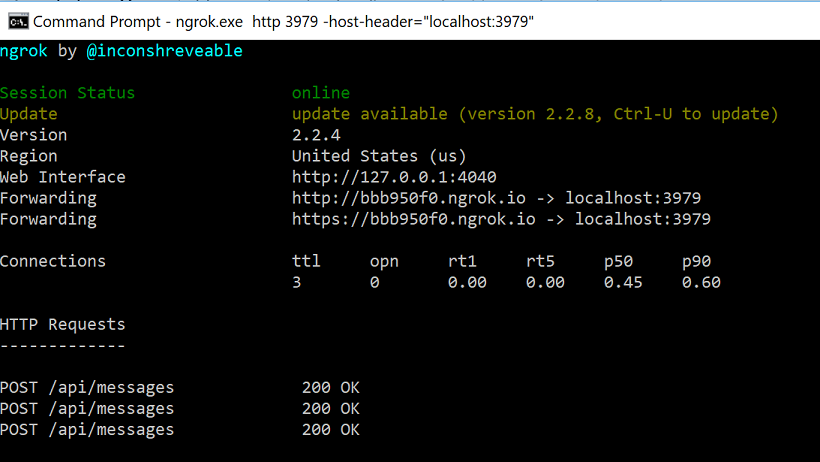
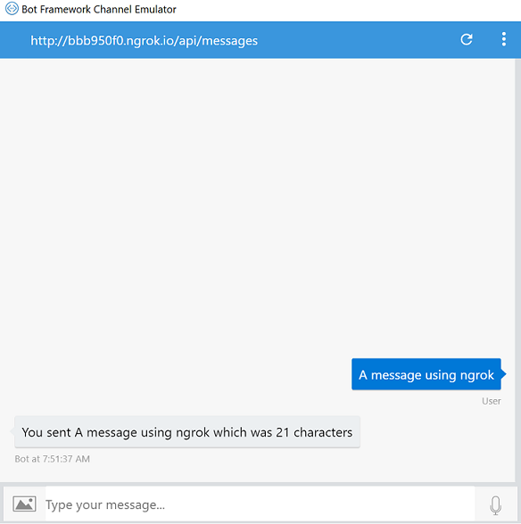

# Development and Testing with Ngrok
 
## 1.	Objectives
 
With Microsoft Bot Framework, to configure the bot to be available to a particular channel, you will need to host the Bot service on a public URL endpoint. The channel will not be able to access your bot service if it is on a local server port hidden behind a NAT or firewall.
  
When designing / building / testing your code, you do not always want to have to keep redeploying. This will result in additional hosting costs. This is where ngrok can really help in speeding up the development/testing phases of bots. The goal of this lab is to use ngrok to expose your bot to public internet and use the public endpoints to test your bots in the emulator.
  
## 2.	Setup
  
 a.	  If you do not have ngrok installed, download ngrok from https://ngrok.com/download and install for your OS. Unzip ngrok file downloaded and install it.

 b.	  Open any Bot project (from the previous labs) in Visual Studio and run it. If you are using EchoBot, you should be seeing the below message in the browser:

**EchoBot**

Describe your bot here and your terms of use etc.

Visit Bot Framework to register your bot. When you register it, remember to set your bot's endpoint to https://your_bots_hostname/api/messages

*** The above information is informational only. You do not need to register your bot for this lab.

## 3.	Forwarding

 a.	 Given the bot is being hosted on localhost:3979, we can use ngrok to expose this port to the public internet

 b.	 Open terminal and go to the folder where ngrok is installed
 
 c.	 Run the below command and you should see the forwarding url:

 ````ngrok.exe http 3979 -host-header="localhost:3979"````



 e.	 Enter the forwarding url (http) in the bot emulator. The bot url will have /api/messages appended to the forwarding url. Test the bot in the emulator by sending messages. We have now used a public endpoint instead of localhost to test the bot.




## 4.	Finish early? Try this exercise for extra credit:

 When you register the bot on the Microsoft Bot Framework, can you use the forwarding url for the Messaging Endpoint? Test the bot on a channel using the forwarding URL on any channel (skype for example).